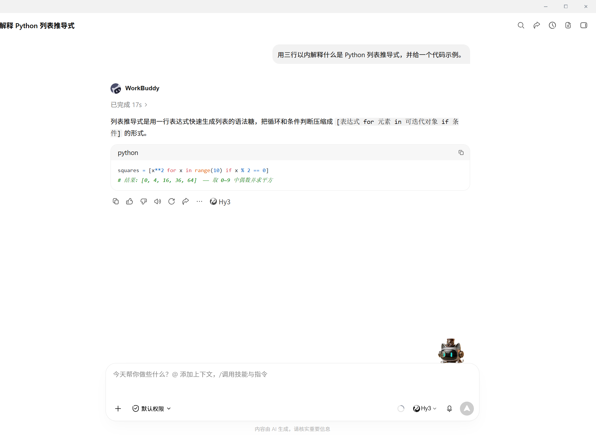
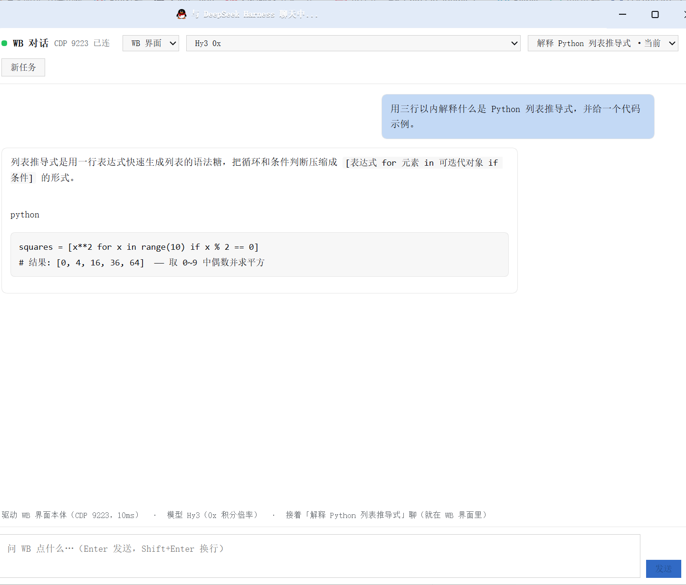
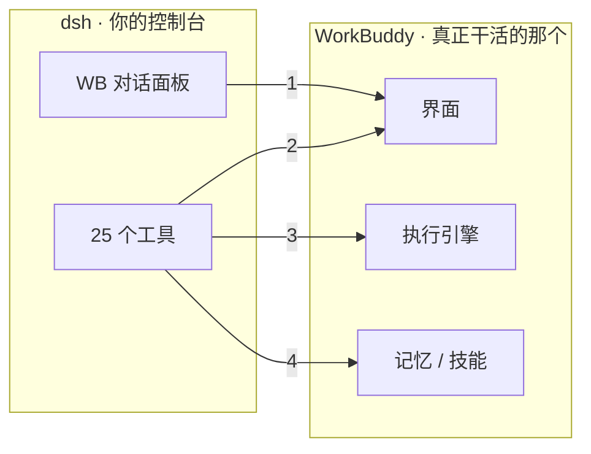

# dsh-wb —— 让 DeepSeek Harness 和 WorkBuddy 互相认识


一句话：装了它，你在 dsh 里就能**看到 WorkBuddy 记了什么、让它干活、跟它对话，甚至直接用 dsh 操作 WorkBuddy 的界面**。

---

## 这是干什么的

WorkBuddy 和 dsh 本来是两套各干各的 AI 工具：各聊各的、各记各的。这个插件把它们连起来 —— 装**一个**插件，多出**四样能力**：

| 你能做的事 | 说白了就是 |
|---|---|
| 📚 **看它记住了什么** | 把 WorkBuddy 的记忆、技能、计划列出来、搜出来、读出来 |
| 🛠️ **让它干活** | 把任务丢给 WorkBuddy 本机的执行引擎，跑完把结果拿回来 |
| 💬 **在 dsh 里跟它聊** | dsh 里多一个「WB 对话」面板，不用来回切窗口 |
| 🖱️ **直接操作它的界面** | 打开它的历史对话、替它发消息 —— **对话留在 WorkBuddy 里**，用它自己的账号额度 |

最后一条是重点：不是"另起一个进程偷偷跑"，而是**真的在 WorkBuddy 界面里操作**。所以你在旁边看着，能看见字一个个打进去。



上图是 **WorkBuddy 那边**的样子 —— 对话真的长在它的界面里。

下图是 **dsh 这边**的面板：左边选会话、中间看内容、上面切模型（带积分倍率）。



---

## 你需要什么

- **Windows**（目前按 Windows 实现）
- 装好 **dsh 桌面版**
- 装好 **WorkBuddy 桌面版**
- 会点图标就行

---

## 安装

三种方式，挑一种：

**① 一条地址装（推荐，最省事，不需要任何账号）**

在 dsh 的插件管理里「从地址安装」，粘这个：

```
https://github.com/YE-ZINAN/dsh-wb/releases/download/v1.0.0/dsh-wb-1.0.0.tgz
```

（它就是个 npm 包，dsh 会自动下载依赖装好。）

**② 从 GitHub 仓库直接装**

```
github:YE-ZINAN/dsh-wb
```

**③ 本地文件夹**

把仓库下载下来，在插件管理里选那个文件夹。

> **npm**：包名 `dsh-wb` 已确认可用，但本机还没登录 npm（`npm login` 只能你本人做）。
> 你登录后任一时刻执行 `npm publish` 就能发上去 —— 之后大家用 `dsh-wb` 这个包名装即可。

装完 **刷新一次 dsh 页面**（F5），左栏会多一个 WB 图标。

---

## 第一次用

1. 点左栏的 **WB 图标**，打开对话面板
2. 顶上「传输方式」保持 **WB 界面**（这样对话才出现在 WorkBuddy 里）
3. 「会话」下拉选一段历史 → 它会**在 WorkBuddy 里真的切过去**，面板同步显示那段历史
4. 下面输入框打字，回车

> 只想让它后台跑、不碰界面？把「传输方式」切成 **无界面**。

---

## 工作原理（一眼看懂）



① HTTP 路由：面板通过宿主的路由直接读写界面内容
② CDP 调试端口：工具在**真实界面**里点击、输入、发送
③ headless 进程：另起一个命令行进程干活（界面里看不到，但最稳）
④ 直接读写文件：同步记忆与技能清单

四块各走各的路，互不影响：

| 模块 | 走哪条路 | 什么时候用它 |
|---|---|---|
| `sync` | 直接读写文件 | 想把两边的记忆和技能清单对齐 |
| `bridge` | 另起一个命令行进程 | 让它稳稳干活（界面里看不到，但最快最省事） |
| `gui` | CDP 调试端口 | 操作真实界面、想看着它干 |
| `chat` | 上面几个的合体 | 就是那个对话面板 |

---

## 安全提醒（请读一遍）

- **调试端口开着的时候，本机上任何程序都能完全控制 WorkBuddy**（读你所有会话、替你发消息）。
  端口只绑 `127.0.0.1`，**手机和局域网进不来**，但本机程序没有门槛。
- 不想长期开着：关掉 WorkBuddy，或下次**不带参数**启动，端口就没了。
- 这个插件**不读你的 API key**。它用的是 WorkBuddy 自己的账号额度；就算你在引擎配置里放了私有 key，本插件也从不读取、不转发。
- 界面模式抓的是界面上的文字，只在你本机流转，不会上传到任何地方。

## 它不会动你的东西

- **不删、不改**你的 WorkBuddy 数据；
- 同步只往你指定的日志文件里**追加**，写前自动备份（`.bak-dshsync`），每次写了什么都有台账可查；
- 身份类信息**永不自动写入**，要你自己确认。

---

## 遇到问题

**面板显示「CDP 未连」**
WorkBuddy 是普通方式启动的，没开调试端口。两个办法：
1. 点面板上的「**启动/重连 WB**」—— 它会关掉并重启 WorkBuddy 并带上端口。会话不会丢（都落盘了）。
2. 一劳永逸：把开始菜单里 WorkBuddy 快捷方式的启动参数改成
   `--remote-debugging-port=9223 --disable-backgrounding-occluded-windows --disable-renderer-backgrounding --disable-background-timer-throttling --disable-features=CalculateNativeWinOcclusion`
   以后每次启动都自带端口，最小化时界面也不卡。

**WorkBuddy 最小化时界面好像不动**
Chromium 对最小化窗口会停止重绘 —— 上面那串参数里的后半段就是解决它的。

**对话串到别的会话里了**
早期版本有这个 bug（已修）。如果还遇到，把当时的操作顺序告诉作者。

---

## 想深入了解

- [技术总览](docs/architecture.md)：结构、配置、回滚
- 四个模块的实测细节（含踩过的坑）：[sync](docs/sync.md) · [bridge](docs/bridge.md) · [chat](docs/chat.md) · [gui](docs/gui.md)

## 规模

25 个工具 / 15 条 HTTP 路由 / 1 个对话面板 —— 四个模块合成一个插件。所有测试加起来 **210 项断言**，全绿。

## 许可

MIT
